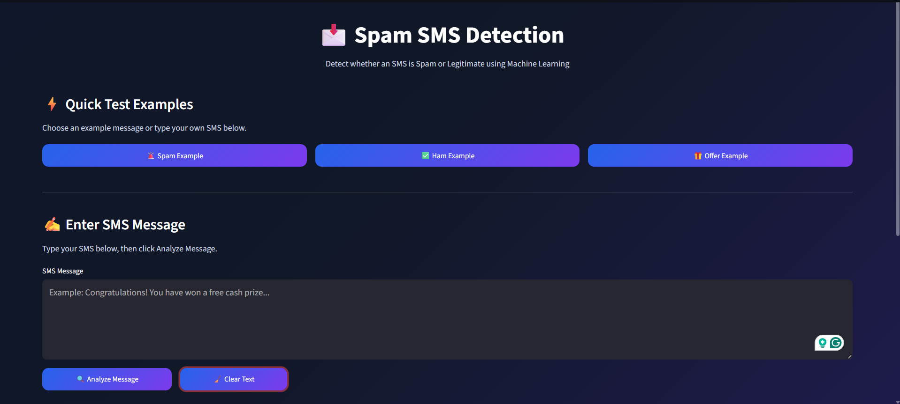
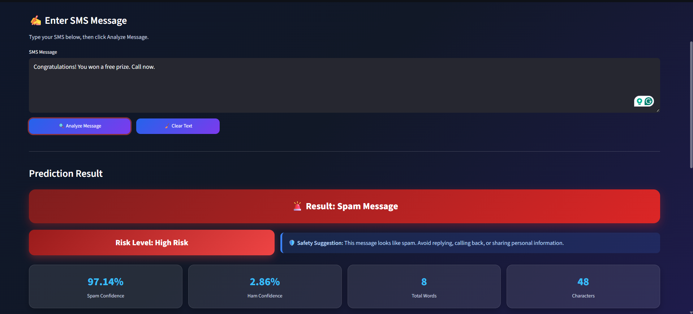
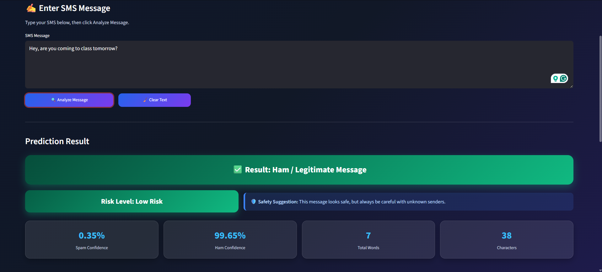

# Spam SMS Detection

A machine learning web application that detects spam SMS messages using text preprocessing, TF-IDF vectorization, and classical machine learning models.

The app is built with Streamlit and provides an interactive interface for testing SMS messages, viewing confidence scores, evaluating risk, and downloading prediction reports.

---

## Live Demo

Try the app live here:

[Spam SMS Detection App](https://codsoft-spam-sms-detector.streamlit.app/)

---

## Project Overview

This project classifies SMS messages into two categories:

- **Spam**: Unwanted or malicious messages
- **Ham / Legitimate**: Normal, safe messages

The pipeline includes:

1. Text cleaning and preprocessing
2. TF-IDF feature extraction
3. Machine learning classification
4. Streamlit UI for prediction and report generation

---

## Features

- Predicts SMS messages as **Spam** or **Ham / Legitimate**
- Displays spam and ham confidence scores
- Computes a risk level and safety suggestion
- Detects suspicious keywords and links
- Shows message statistics (word count, character count)
- Includes example test messages for quick evaluation
- Saves prediction history during the session
- Provides downloadable prediction reports
- Clean and responsive Streamlit interface

---

## Technologies Used

- Python
- pandas
- NumPy
- scikit-learn
- joblib
- Streamlit
- TF-IDF feature extraction
- Multinomial Naive Bayes
- Logistic Regression

---

## Dataset

The project uses the **SMS Spam Collection Dataset**.

Each SMS entry is labeled as:

- `ham`: Legitimate message
- `spam`: Spam message

The dataset file should be located at:

```text
data/spam.csv
```

---

## Installation

1. Create and activate a virtual environment:

```bash
python -m venv .venv
.venv\Scripts\activate    # Windows PowerShell
```

2. Install the required libraries:

```bash
pip install -r requirements.txt
```

3. Ensure the dataset exists at `data/spam.csv`.

---

## Train the Model

To train the model and save the artifacts, run:

```bash
python train_model.py
```

This script will:

- Load the dataset from `data/spam.csv`
- Clean and preprocess SMS text
- Convert text to TF-IDF vectors
- Train Naive Bayes and Logistic Regression models
- Display model evaluation metrics
- Save the final model and vectorizer to `models/`

---

## Run the App

Start the Streamlit application:

```bash
streamlit run app.py
```

Use the web interface to:

- Enter an SMS message
- Analyze the message
- View prediction results, confidence scores, and risk level
- Download a prediction report

---

## Project Structure

```text
Spam_SMS_Detection/
├── app.py
├── train_model.py
├── requirements.txt
├── README.md
├── data/
│   └── spam.csv
├── models/
│   ├── spam_model.pkl
│   └── vectorizer.pkl
├── screenshots/
│   ├── home.png
│   ├── spam_result.png
│   └── ham_result.png
└── .gitignore
```

---

## Model Performance

| Model | Accuracy |
|---|---:|
| Naive Bayes | 97.04% |
| Logistic Regression | 96.41% |

The training script saved the Naive Bayes model as the final prediction model.

---

## Screenshots

### Home Page


### Spam Prediction Result


### Ham Prediction Result


---

## Notes

- `app.py` requires `models/spam_model.pkl` and `models/vectorizer.pkl` to run.
- The dataset should contain `v1` and `v2` columns. The training script renames them to `label` and `message`.
- This project is ideal for learning text classification and deploying a simple Streamlit app.

---

## Author

**Rittik Basak**

---

## License

This project is created for educational and internship purposes.
